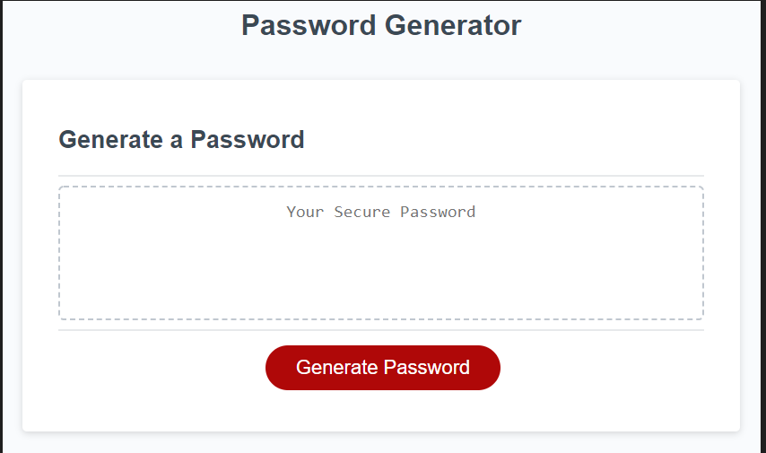

# Fort_knox

# User Story 

Project title- Fort Knox

Motovation/Reason -  AS AN employee with access to sensitive data

I WANT to randomly generate a password that meets certain criteria

SO THAT I can create a strong password that provides greater security

Project Description-  the asssignment is to make a password generator that randomly generates based on criteria that the user confirms when asked a series of 
questions. 

The options to be confirmed are uppercase, lowercase, special characters, and numerals. user has to confirm at least one of the options to contuine. 

after the questions are confirmed a password will generate. The prompts are utilized to help make a strong password. 

 
#
How to run project- Answer the prompts, after the prompts have been answered a password will generate from the confirmed criteria. 

How to use Project -  if a user needs a password, they can use the application to generate a password.

Credits- All the SMU training files

